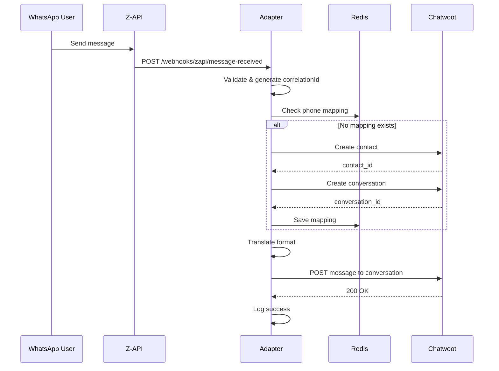
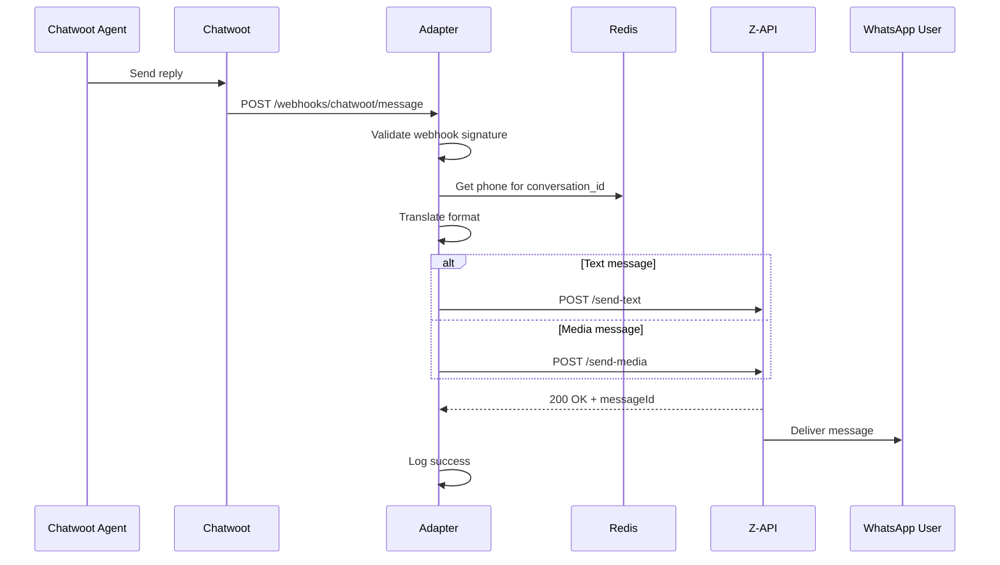

# Arquitetura do Sistema - WAUAC (WhatsApp API Universal Adapter)

## 📐 Visão Geral da Arquitetura

### Diagrama de Alto Nível
```
┌─────────────────────────────────────────────────────────────┐
│                        WHATSAPP                             │
└─────────────────┬───────────────────────┬───────────────────┘
                  │                       │
                  ▼                       ▼
        ┌─────────────────┐     ┌─────────────────┐
        │     Z-API       │     │  Evolution API   │ (futuro)
        │   (Provider)    │     │   (Provider)     │
        └────────┬────────┘     └─────────────────┘
                 │ Webhooks
                 ▼
        ┌────────────────────────────────────────┐
        │         WAUAC ADAPTER                  │
        │  ┌──────────────────────────────┐     │
        │  │   Webhook Receivers          │     │
        │  ├──────────────────────────────┤     │
        │  │   Format Translators         │     │
        │  ├──────────────────────────────┤     │
        │  │   State Manager (Cache)      │     │
        │  ├──────────────────────────────┤     │
        │  │   Message Router             │     │
        │  ├──────────────────────────────┤     │
        │  │   Observability Layer        │     │
        │  └──────────────────────────────┘     │
        └────────────┬───────────────────────────┘
                     │ API Calls
                     ▼
        ┌────────────────────────────────────────┐
        │           CHATWOOT                     │
        │     (Conversation Platform)            │
        └─────────────────────────────────────────┘
```

### Padrão Arquitetural
- **Tipo**: Microserviço Adaptador (Adapter Pattern)
- **Justificativa**: Desacoplamento total entre sistemas incompatíveis
- **Trade-offs**: 
  - ✅ Flexibilidade para adicionar APIs
  - ✅ Isolamento de falhas
  - ⚠️ Latência adicional (~100ms)
  - ⚠️ Ponto único de falha (mitigado com health checks)

---

## 🏗️ Princípios Arquiteturais

1. **Observability First**
   - Cada operação tem correlation ID
   - Logs estruturados em TODAS as etapas
   - Debug UI para troubleshooting

2. **Fail Fast, Recover Gracefully**
   - Validação imediata de inputs
   - Retry com exponential backoff
   - Circuit breaker para APIs externas

3. **Stateless Design**
   - Estado apenas no Redis
   - Containers podem escalar horizontalmente
   - Sem dependência de arquivo local

4. **Plugin Architecture**
   - Cada API é um plugin isolado
   - Interface comum para todos adaptadores
   - Adicionar nova API não quebra existentes

---

## 🔧 Componentes do Sistema

### Webhook Receivers
**Responsabilidades:**
- Receber POST requests das APIs
- Validar assinatura/autenticidade
- Parse de diferentes formatos
- Enqueue para processamento

**Tecnologias:**
- Express.js com raw body parser
- Joi para validação de schema
- Bull para queue (Redis-backed)

**Padrões:**
- Webhook handler por API
- Validation middleware
- Correlation ID injection

**Endpoints:**
```typescript
POST /webhooks/zapi/message-received
POST /webhooks/zapi/message-status  
POST /webhooks/zapi/connection-status
POST /webhooks/chatwoot/message
```

### Format Translators
**Responsabilidades:**
- Converter Z-API → Chatwoot format
- Converter Chatwoot → Z-API format
- Mapear tipos de mídia
- Normalizar metadados

**Tecnologias:**
- TypeScript interfaces
- Class-based translators
- Factory pattern

**Mapeamentos Principais:**
```typescript
// Z-API → Chatwoot
{
  phone: "5511999999999" → contact_identifier
  message.text → content
  type: "chat" → message_type: "incoming"
  messageId → source_id
}

// Chatwoot → Z-API
{
  conversation_id → phone (via cache lookup)
  content → message
  attachments[0] → detect type → appropriate endpoint
}
```

### State Manager (Cache)
**Responsabilidades:**
- Manter mapeamento phone ↔ IDs
- Cache de contatos
- Cache de conversas ativas
- TTL management

**Tecnologias:**
- Redis 7
- ioredis client
- TTL: 7 dias (configurável)

**Estrutura de Dados:**
```typescript
// Phone → Chatwoot IDs
phone:5511999999999 = {
  contact_id: 123,
  conversation_id: 456,
  last_message_at: "2025-09-20T10:00:00Z",
  instance_id: "zapi-instance-1"
}

// Conversation → Phone
conversation:456 = {
  phone: "5511999999999",
  contact_name: "João Silva",
  created_at: "2025-09-20T09:00:00Z"
}

// Metrics
metrics:messages:2025-09-20 = {
  received: 150,
  sent: 148,
  errors: 2
}
```

### Message Router
**Responsabilidades:**
- Direcionar mensagens para destino correto
- Gerenciar filas com prioridade
- Retry logic
- Rate limiting

**Tecnologias:**
- Bull queues
- p-retry para retry logic
- Bottleneck para rate limiting

**Fluxos:**
```typescript
// Incoming (WhatsApp → Chatwoot)
1. Receive webhook → validate
2. Check cache for existing conversation
3. If not exists: create contact → create conversation
4. Send message to conversation
5. Update cache with mappings

// Outgoing (Chatwoot → WhatsApp)
1. Receive webhook from Chatwoot
2. Lookup phone in cache
3. Format message for Z-API
4. Send via appropriate endpoint (text/media)
5. Handle delivery confirmation
```

### Observability Layer
**Responsabilidades:**
- Structured logging
- Metrics collection
- Health checks
- Debug interface

**Tecnologias:**
- Winston para logs
- prom-client para métricas
- Express para debug UI

**Métricas Coletadas:**
```typescript
// Counters
messages_received_total
messages_sent_total
messages_failed_total
webhooks_received_total

// Histograms
message_processing_duration_seconds
api_call_duration_seconds

// Gauges
active_conversations
cache_size_bytes
queue_depth
```

**Debug Interface:**
```
GET /debug                    → Dashboard HTML
GET /debug/messages          → Last 100 messages
GET /debug/mappings          → Current cache mappings
GET /debug/metrics           → Prometheus metrics
GET /debug/logs             → Last 500 log entries
GET /health                 → Health status
GET /health/detailed        → Detailed health
```

---

## 🔐 Segurança

### Validação de Webhooks
```typescript
// Z-API validation
- Check source IP against whitelist
- Validate payload structure
- Sanitize input data

// Chatwoot validation  
- Verify webhook signature (HMAC)
- Check api_access_token
```

### Proteções Implementadas
- [x] Input sanitization (xss, sql injection)
- [x] Rate limiting per endpoint
- [x] Correlation IDs para auditoria
- [x] Secrets em environment variables
- [x] HTTPS only para produção
- [x] No sensitive data in logs

---

## ⚡ Performance

### Otimizações

#### Cache Strategy
```typescript
// Multi-tier cache
1. Memory cache (LRU, 100 items)
2. Redis cache (7 days TTL)
3. Lazy loading from Chatwoot API

// Cache warming
- Pre-load active conversations
- Refresh antes de TTL expirar
```

#### Queue Management
```typescript
// Priority queues
- High: Status updates, delivery receipts
- Normal: Regular messages
- Low: Media messages

// Batching
- Agregar múltiplas mensagens do mesmo usuário
- Enviar em batch para Chatwoot (max 10)
```

#### Connection Pooling
```typescript
// HTTP agents
- maxSockets: 50 para Z-API
- maxSockets: 25 para Chatwoot
- keepAlive: true
- timeout: 30s
```

### Métricas Alvo
| Métrica | Target | Atual | Status |
|---------|--------|-------|--------|
| Message latency (p50) | < 100ms | - | ⏳ |
| Message latency (p95) | < 200ms | - | ⏳ |
| Message latency (p99) | < 500ms | - | ⏳ |
| Throughput | 1000/min | - | ⏳ |
| Error rate | < 0.1% | - | ⏳ |
| Memory usage | < 512MB | - | ⏳ |

---

## 📈 Escalabilidade

### Horizontal Scaling
```yaml
# Docker Swarm / K8s ready
Replicas: 1-3 (baseado em carga)
Load Balancer: Nginx (round-robin)
Session Affinity: Não necessário (stateless)
Shared State: Redis cluster
```

### Pontos de Bottleneck
1. **Redis**: Solução → Redis Cluster
2. **Chatwoot API**: Solução → Queue + rate limiting
3. **Z-API Rate Limits**: Solução → Multiple instances

---

## 🔄 Fluxos Detalhados

### Fluxo: Nova Mensagem WhatsApp


### Fluxo: Resposta do Agente


---

## 🐳 Infraestrutura

### Docker Configuration
```yaml
version: '3.8'

services:
  adapter:
    build: .
    container_name: wauac-adapter
    ports:
      - "3333:3333"
    networks:
      - chatwoot_network
    environment:
      - NODE_ENV=production
      - REDIS_URL=redis://redis:6379
      - CHATWOOT_URL=http://chatwoot_web:3000
    depends_on:
      - redis
    restart: unless-stopped
    healthcheck:
      test: ["CMD", "curl", "-f", "http://localhost:3333/health"]
      interval: 30s
      timeout: 10s
      retries: 3

  redis:
    image: redis:7-alpine
    container_name: wauac-redis
    networks:
      - chatwoot_network
    volumes:
      - redis_data:/data
    restart: unless-stopped

networks:
  chatwoot_network:
    external: true

volumes:
  redis_data:
```

### Environment Variables
```bash
# Server
PORT=3333
NODE_ENV=production

# Redis
REDIS_URL=redis://redis:6379
REDIS_TTL_DAYS=7

# Chatwoot
CHATWOOT_URL=http://chatwoot_web:3000
CHATWOOT_API_KEY=your_api_key
CHATWOOT_ACCOUNT_ID=1
CHATWOOT_INBOX_ID=2

# Z-API
ZAPI_INSTANCE_ID=your_instance
ZAPI_TOKEN=your_token
ZAPI_CLIENT_TOKEN=your_client_token
ZAPI_BASE_URL=https://api.z-api.io

# Observability
LOG_LEVEL=info
DEBUG_UI_ENABLED=true
METRICS_ENABLED=true

# Security
WEBHOOK_SECRET=your_webhook_secret
ALLOWED_IPS=168.75.0.0/16
```

---

## 💰 Custos e Trade-offs

### Custos de Infraestrutura
| Componente | Recurso | Custo Adicional |
|------------|---------|-----------------|
| Adapter | 512MB RAM, 0.5 CPU | $0 (mesmo servidor) |
| Redis | 256MB RAM | $0 (já existe) |
| SSL | Let's Encrypt | $0 |
| **Total** | - | **$0/mês** |

### Trade-offs Arquiteturais
| Decisão | Benefício | Custo | Justificativa |
|---------|-----------|-------|---------------|
| Adapter intermediário | Flexibilidade total | +100ms latência | Permite múltiplas APIs |
| Cache Redis | Performance | Complexidade cache invalidation | Reduz chamadas API |
| TypeScript | Type safety | Build step | Menos bugs runtime |
| Observability completa | Debug fácil | +50MB RAM | Crítico para troubleshooting |

---

## 📋 Checklist de Qualidade

### Código
- [ ] TypeScript strict mode
- [ ] 100% dos endpoints com testes
- [ ] Correlation IDs em todo fluxo
- [ ] Graceful shutdown implementado
- [ ] Health checks detalhados

### Segurança
- [ ] Input validation em todos endpoints
- [ ] Rate limiting configurado
- [ ] Secrets em env vars
- [ ] HTTPS em produção
- [ ] Logs sem dados sensíveis

### Performance
- [ ] Latência < 200ms p95
- [ ] Memory < 512MB
- [ ] Zero memory leaks
- [ ] Cache hit rate > 90%

### Observabilidade
- [ ] Logs estruturados
- [ ] Métricas Prometheus
- [ ] Debug UI funcional
- [ ] Alertas configurados

---

*Documento mantido por: Camilo (PO) + Claude (Assistant)*
*Última revisão: 20/09/2025*
*Para usar: Copie para /opt/wauac-adapter/docs/ARCHITECTURE.md*